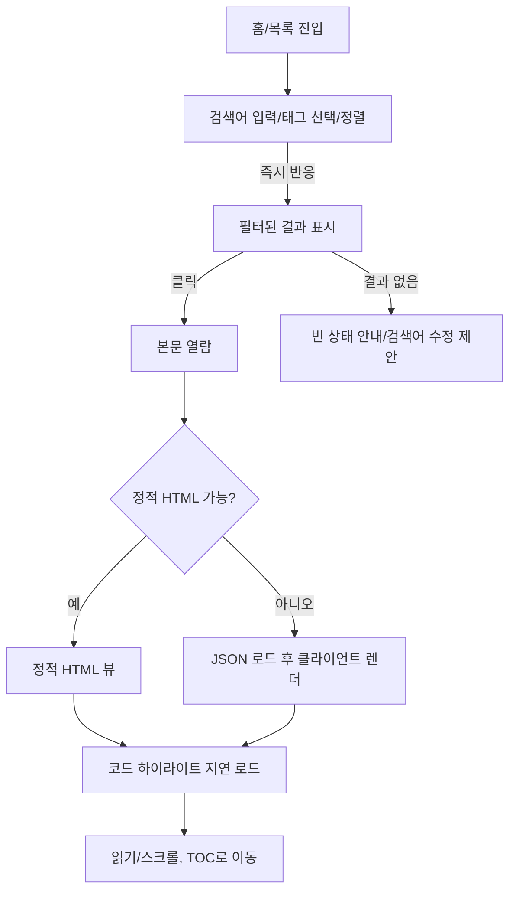

---
stepsCompleted:
  - 1
  - 2
  - 3
  - 4
  - 5
  - 6
  - 7
  - 8
  - 9
  - 10
  - 11
  - 12
  - 13
  - 14
  - 11
  - 9
inputDocuments:
  - docs/prd.md
workflowType: 'ux-design'
lastStep: 14
project_name: 'ygpark2.github.io'
user_name: 'ygpark2.github.io'
date: '2025-12-13T12:49:25+09:00'
---

# UX Design Specification ygpark2.github.io

**Author:** ygpark2.github.io  
**Date:** 2025-12-13T12:49:25+09:00

---

<!-- UX design content will be appended sequentially through collaborative workflow steps -->

## Executive Summary

### Project Vision
- Hakyll 정적 사이트에 메타/요약 JSON을 추가해 SPA로 목록/검색/정렬을 빠르게 렌더. SEO·정적 HTML 유지, 빌드/배포 성능 개선.

### Target Users
- 독자: 빠른 검색/필터/정렬로 원하는 글을 즉시 찾고 읽고 싶음
- 작성자: 빌드·배포가 짧고(전체<3분, 증분<1분) 바로 목록/검색에 반영되길 원함
- 운영자: 빌드/JSON/번들 크기·캐시 상태를 모니터링하며 안정 배포를 원하는 관리자

### Key Design Challenges
- SPA + 정적 HTML(SEO) 하이브리드: CSR-only 금지, 프리렌더/정적 페이지 병행
- 성능/접근성: 메타 JSON 로드 1.5초 내, 인터랙션 <10ms, WCAG AA 충족
- 검색/정렬 UX: 제목/태그/본문 전체 검색, 최신/제목/태그/인기 정렬을 리로드 없이 자연스럽게 제공

### Design Opportunities
- 경량 메타 JSON 기반 즉시 검색/필터/정렬로 체감 속도 차별화
- 정적 HTML 폴백 + 지연 하이라이트로 가벼운 본문 뷰
- 빌드/배포 상태와 성능 지표(로드 시간, LCP) 노출로 투명한 운영 UX

## Core User Experience

### Defining Experience
- 핵심 루프: 목록/검색 → 클릭해 본문 열람(주 사용: 키보드/마우스, 웹 데스크톱/모바일 브라우저)

### Platform Strategy
- 플랫폼: 웹(데스크톱/모바일 브라우저), 입력: 키보드/마우스 중심, 터치는 보조
- 오프라인: 필요 없음
- 아키텍처: SPA + 정적 HTML 하이브리드(SEO 유지)

### Effortless Interactions
- 검색/필터: 리로드 없이 즉시 반응
- 본문 열람: 지연 없는 가독성, 필요 시 정적 HTML 폴백

### Critical Success Moments
- 검색 후 원하는 포스트를 한 번에 찾아 바로 읽을 때
- 빌드 후 새 포스트가 목록/검색에 즉시 반영될 때

### Experience Principles
- 빠른 발견: 메타 JSON 기반 즉시 검색/필터/정렬
- 끊김 없는 읽기: 경량 페이지, 지연 없는 본문 렌더
- 투명한 반영: 빌드/배포 후 즉각 노출, 리스트/검색 동기
- 하이브리드 일관성: SEO/접근성을 유지하는 SPA+정적 구조

## Desired Emotional Response

### Primary Emotional Goals
- “빠르고 가볍다”, “안심/신뢰”, “통제 감”, 만족감

### Emotional Journey Mapping
- 진입/검색: 빠르고 가볍다, 통제감(검색/필터 즉시 반응)
- 본문 열람: 지연 없는 읽기 → 만족감, 안심
- 빌드 반영: 즉시 목록/검색에 노출 → 통제감, 신뢰
- 재방문: 믿을 만한 속도, 부담 없는 경험
- 피해야 할 감정: 답답함, 느림, 불안정

### Micro-Emotions
- 자신감/통제 vs. 답답함/느림
- 신뢰/안정 vs. 불안정/지연
- 만족/가벼움 vs. 무거움/대기

### Design Implications
- 속도 감각: 즉시 검색/필터, 지연 없는 렌더, 로딩 표시 최소화
- 신뢰: 정적 HTML 폴백, 오류 시 명확한 복구 메시지
- 통제감: 정렬/필터 명확한 상태 표현, 즉각 반영
- 부담 없음: 단순한 IA/네비게이션, 불필요한 단계 제거

### Emotional Design Principles
- 즉시성으로 안심과 가벼움을 준다.
- 폴백과 명확한 상태 표현으로 신뢰와 통제감을 유지한다.
- 핵심 흐름(검색→읽기, 빌드→노출)에서 대기·불확실성을 없앤다.

## UX Pattern Analysis & Inspiration

### Inspiring Products Analysis
- Minimal Mistakes 테마: 좌측/상단 내비와 두 열 레이아웃, 명확한 메타정보(날짜/태그), 코드 하이라이트, 목차/앵커, 페이징·검색(lunr 기반)으로 컨텐츠 탐색성이 높음.
- CloudCannon 샘플 블로그(jazzed-kale*): 심플한 타이포그래피·여백 중심, 상단 네비+카드형 목록, 반응형 레이아웃으로 가벼운 첫인상 제공.
(*네트워크 제한으로 실시간 확인은 못 했고, 제공된 링크 특성상 정적 블로그 템플릿 패턴을 기준으로 정리했습니다.)

### Transferable UX Patterns
- 목록 탐색: 카드형/리스트형 혼합 + 명확한 메타(날짜/태그) 노출, 태그 배지로 즉시 필터 유도.
- 네비게이션: 상단 고정 내비 + 본문 내 TOC/앵커로 긴 글도 빠르게 이동.
- 검색/정렬: 클라이언트 검색 인덱스(JSON) + 정렬 옵션(최신/제목/태그/인기) 즉시 적용.
- 가독성: 넉넉한 행간/여백, 코드 하이라이트 지연 로드, 작은 화면에서 단일 컬럼으로 자연 전환.

### Anti-Patterns to Avoid
- 무거운 히어로/대형 이미지로 초기 로드를 느리게 만드는 것.
- 검색/정렬 상태를 숨기거나 리로드 요구하는 패턴.
- 모바일에서 좌우 2열 고정으로 가독성을 해치는 레이아웃.
- 불명확한 에러/빈 검색 결과 처리.

### Design Inspiration Strategy
- Adopt: TOC/앵커, 상단 고정 네비, 메타/태그 배지 노출, 가벼운 카드형 목록.
- Adapt: 검색/정렬을 메타 JSON 인덱스 기반으로 즉시 반영하고, 모바일에서는 단일 컬럼에 필터/정렬을 접이식으로 배치.
- Avoid: 초기 큰 자산, 복잡한 애니메이션, CSR-only 검색(정적 HTML 폴백 유지).

## Core Experience Definition

### 2.1 Defining Experience
- 핵심 상호작용: 목록/검색 → 클릭해 본문 열람(웹, 데스크톱/모바일 브라우저, 키보드/마우스 중심)

### 2.2 User Mental Model
- 기대: 검색/필터 후 즉시 결과가 바뀌고, 클릭 시 바로 읽힘(정적 HTML 기본). 정렬/필터 상태가 명확히 보이고 유지되길 기대.
- 현재 유사 패턴: 블로그/검색 리스트에서 즉시 반응하는 SPA 경험, TOC/앵커로 빠르게 이동.

### 2.3 Success Criteria
- 검색/필터/정렬이 리로드 없이 즉시 반응.
- 본문이 지연 없이 가독성 있게 열림(필요 시 정적 HTML 폴백).
- 새 포스트가 빌드 후 즉시 목록/검색에 반영되어 “바로 반영됐다”는 신뢰와 통제감을 줌.

### 2.4 Novel UX Patterns
- 정적 HTML + SPA 하이브리드(SEO 유지) 위에 클라이언트 검색/정렬을 얹는 익숙한 패턴 사용. 새 교육이 필요 없는 익숙한 검색/필터/정렬 UX를 채택.

### 2.5 Experience Mechanics
- 시작: 상단 검색/필터/정렬 바가 바로 노출, 기본은 최신순.
- 상호작용: 입력/선택 시 즉시 결과 업데이트, 태그 배지/필터 상태가 명확히 표시.
- 피드백: 결과 수 변화, 정렬/필터 상태 표시, 빈 결과 시 안내 메시지.
- 완료: 사용자가 원하는 포스트를 한 번에 찾아 클릭해 읽음; 새 포스트는 빌드 직후 목록/검색에 노출.

## Visual Design Foundation

### Color System
- 방향: 밝고 가벼운 Light 테마 기본 + 선택 가능한 Dark 테마 제공
- Light: 높은 명도 배경, 저채도 포인트 1색(예: 블루/티얼), 중간 톤 텍스트 대비 확보
- Dark: 저명도 배경, 동일 포인트 색 재사용, 대비 준수로 가독성 확보
- Semantic: Primary(액션), Neutral(배경/구분), Success/Warning/Error는 낮은 채도 중심
- 접근성: WCAG AA 대비 기준 준수

### Typography System
- 폰트: Noto Sans CJK (산세리프, 가독성 우선)
- 타입 스케일: 본문 중심 가독성, 충분한 행간/여백
- 일관성: 본문/헤더/메타 텍스트 모두 동일 폰트 스택 사용

### Spacing & Layout Foundation
- 스페이싱: 8px 베이스 그리드, 여백을 넉넉히 해 밝고 가벼운 톤 유지
- 레이아웃: 반응형 그리드(데스크톱 12컬럼, 모바일 단일 컬럼), 상단 내비 + 목록/TOC 패턴
- 컴포넌트: 카드/리스트/배지/검색·정렬 바에 일관된 패딩·간격 적용

### Accessibility Considerations
- 대비: 텍스트/아이콘 대비 AA 충족, 포커스 스타일 명확
- 상호작용: 키보드 내비게이션, 상태 표시(필터/정렬/로딩/빈 상태/에러) 명확
- 모드: Light/Dark 전환 시 대비 유지, 폴백 정적 HTML 가독성 유지

## Design Direction Decision

### Design Directions Explored
- 밝고 미니멀 톤, 카드 중심 목록, 상단 고정 내비 + 검색/정렬 바 + TOC 패턴
- Light 기본 + 선택적 Dark, Tailwind 기반 테마블 접근

### Chosen Direction
- 밝고 미니멀 + 카드 중심 목록
- 상단 고정 내비 + 검색/정렬 바 + TOC
- Light 기본, 선택적 Dark 모드 제공

### Design Rationale
- 핵심 경험(검색→목록→읽기)에서 가벼움/속도/가독성에 집중
- 정적 HTML 폴백과 SPA 검색/정렬이 어울리는 구조
- 메타/태그 노출, TOC/앵커로 긴 글 내비게이션 지원

### Implementation Approach
- Tailwind 테마블 시스템 기반, Light/Dark 토큰 정의
- 카드형 목록 + 상단 네비/검색/정렬 바 + 본문 TOC/앵커 구성
- 반응형: 데스크톱 12컬럼, 모바일 단일 컬럼; 필터/정렬은 접이식으로 처리

## Component Strategy

### Design System Components
- Tailwind 유틸 기반 컴포넌트: 버튼, 입력/폼, 배지, 카드, 내비게이션, 토글, 리스트, 토글 가능한 패널/드로어, 토글 가능한 모달/알림
- 토큰: 컬러(라이트/다크), 타입 스케일, 스페이싱, 포커스/상태 스타일

### Custom Components
- 목록 카드/리스트: 메타(제목/날짜/태그), 정렬/필터 상태 반영, 반응형 카드/리스트 변형
- 검색/정렬/필터 바: 즉시 반응, 상태 표시(정렬/필터 배지), 모바일 접이식
- TOC/앵커 내비: 본문 내 섹션 이동, 상단 고정 가능
- 상태/빈/에러 패널: 결과 없음, 에러, 로딩 상태 표현
- 빌드/배포 지표 블록: 빌드 타임/JSON/번들/캐시 상태 표시(운영자용)

### Component Implementation Strategy
- Tailwind 토큰/유틸로 조합, 필요 시 소형 컴포넌트 래퍼 제작
- 상태/접근성: 포커스/ARIA/키보드 내비게이션, 정렬·필터 상태 뱃지/텍스트로 명확히
- 성능: 필요한 유틸만 사용, purge/treeshake, 지연 로드 가능한 부분(코드 하이라이트 등)은 컴포넌트에서 처리

### Implementation Roadmap
- Phase 1 (MVP): 목록 카드/리스트, 검색·정렬·필터 바, TOC/앵커, 상태/빈/에러 패널
- Phase 2: 빌드/배포 지표 블록, 추가 정렬/필터 변형, Dark 모드 세부 조정
- Phase 3: 고도화된 대시보드/메트릭 위젯, 추가 레이아웃 변형

## UX Consistency Patterns

### Button Hierarchy
- Primary: 주요 액션(검색/정렬 적용, 게시/확인) — 고대비, 명확한 포커스
- Secondary: 취소/보조 액션 — 중간 톤, 링크/텍스트 버튼
- Tertiary/Link: 본문 내 탐색/앵커 이동 — 저대비, 포커스 유지
- 상태: hover/focus/active/disabled 일관, 아이콘+텍스트 조합 가능

### Feedback Patterns
- 성공: 상단/인라인 간결 토스트/메시지, 자동 사라짐
- 오류: 인라인 에러와 요약, 복구 방법 제시(예: 검색어 수정, 재시도)
- 경고/정보: 비차단 알림, 관련 위치에 배치
- 로딩/빈 상태: 스켈레톤/스피너 최소화, 빈 결과 시 제안 문구 제공

### Form Patterns
- 입력/검색: 즉시 반응, 입력 시 클리어 버튼, 접근성 라벨/placeholder 구분
- 선택(정렬/필터): 드롭다운/토글, 현재 상태를 배지/텍스트로 노출
- 검증: 즉시 피드백 + 제출 시 요약, 포커스 이동

### Navigation Patterns
- 상단 고정 내비 + 검색/정렬 바, 카드/리스트/TOC 조합
- TOC/앵커로 본문 내 빠른 이동, 현재 섹션 하이라이트
- 모바일: 단일 컬럼, 검색/필터/정렬은 접이식 패널로 제공

### Additional Patterns
- Empty/에러/로딩 상태: 명확한 메시지와 행동 제안
- 상태 표시: 정렬/필터 활성 상태, 결과 수, 빌드/배포 지표는 명확한 텍스트/아이콘
- 접근성: 키보드 내비, 포커스 스타일, ARIA 라벨/라이브 영역 적용

## Responsive Design & Accessibility

### Responsive Strategy
- 데스크톱: 12컬럼, 상단 고정 내비 + 검색/정렬 바, 카드/리스트/TOC로 여유 있는 레이아웃
- 모바일: 단일 컬럼, 검색/필터/정렬은 접이식 패널, 핵심 정보(제목/날짜/태그) 우선
- 태블릿: 데스크톱과 모바일 중간 밀도, 터치 여백 확보

### Breakpoint Strategy
- Mobile-first, 공통 기준: 모바일(~767px), 태블릿(768–1023px), 데스크톱(1024px+)
- 필요 시 더 좁은 화면에서 검색/필터를 스택/접이식 처리

### Accessibility Strategy
- WCAG AA 목표
- 대비: 최소 4.5:1, 포커스 스타일 명확히
- 입력: 터치 타겟 44x44px 이상, 키보드 내비게이션 필수, ARIA 라벨/라이브 영역 적용
- 모드: Light/Dark 전환 시 대비 유지, 폴백 정적 HTML 가독성 유지

### Testing Strategy
- 반응형: 주요 브라우저(Chrome/Firefox/Safari/Edge), 실제 모바일/태블릿, 네트워크 제약에서 테스트
- 접근성: 자동화(a11y lint), 스크린리더(VoiceOver/NVDA), 키보드 전용, 색각 보정 시뮬레이션

### Implementation Guidelines
- 반응형: rem/%, mobile-first media query, 반응형 이미지/자산, 터치 영역 검증
- 접근성: 시맨틱 HTML, ARIA 역할/라벨, 포커스 관리/skip 링크, 라이브 영역, 높은 대비 모드 고려

## User Journey Flows

### Journey 1: 독자 – 빠른 탐색과 읽기


### Journey 2: 작성자 – 새 포스트 발행
```mermaid
flowchart TD
  A[Markdown 작성] --> B[빌드 실행]
  B --> C{전체/증분 빌드 성공?}
  C -->|예| D[메타/요약 JSON 생성 + 정적 HTML 생성]
  D --> E[검색/목록 인덱스 업데이트]
  E --> F[배포/캐시 무효화(해시)]
  F --> G[목록/검색에서 새 글 노출 확인]
  C -->|아니오| H[에러 표시/로그 확인]
  H --> I[다시 시도 또는 마지막 성공본 롤백]
```

### Journey 3: 운영자 – 배포/모니터링
```mermaid
flowchart TD
  A[빌드/배포 스크립트 실행] --> B[빌드 타임/JSON/번들 크기 로깅]
  B --> C{지표 기준 충족?}
  C -->|예| D[배포 및 CDN 무효화(해시)]
  D --> E[헬스체크: 메타 JSON ≤5MB, 최초 로드/LCP 확인]
  C -->|아니오| F[스키마 축소/자산 정리/재빌드]
  E --> G[모니터링 대시보드 확인]
  F --> B
```

### Journey Patterns
- 검색/정렬/필터는 즉시 반응 + 상태 표시(정렬/필터 배지, 결과 수, 빈 상태 메시지)
- 폴백: 정적 HTML 우선, 실패 시 JSON→클라이언트 렌더
- 상태/오류: 명확한 에러·빈 결과·로딩 표시, 롤백 경로 제공

### Flow Optimization Principles
- 경로 단축: 검색→읽기까지 리로드 없이 2단계(입력/선택 → 클릭)
- 가시성: 정렬/필터/상태를 항상 노출, TOC/앵커로 긴 글 내비게이션
- 복구: 빌드 실패 시 에러 표기와 재시도/롤백 옵션, 빈 검색 시 제안 제공

## Design System Foundation

### 1.1 Design System Choice
- Themeable 시스템 (Tailwind 기반) 선택: 빠른 구현 + 브랜딩 커스터마이즈, 접근성 토큰/유틸 활용, 경량 번들 구성 용이

### Rationale for Selection
- 성능·경량 목표: 필요 유틸만 사용해 번들 최소화, 지연 로드/코드 스플릿과 조합 용이
- 접근성/SEO: 유틸 기반으로 명확한 구조·대비·포커스 스타일을 정의, 정적 HTML/og/meta 유지와 충돌 없음
- 차별화: 기본 유틸 위에 타이포·색·스페이싱·컴포넌트 톤을 브랜드에 맞게 커스터마이즈

### Implementation Approach
- 핵심 토큰 정의: 컬러 팔레트(텍스트/배경/상태), 타이포 스케일, 스페이싱, 라운딩, 그림자 최소 사용
- 레이아웃/컴포넌트: 상단 내비, 카드/리스트, 태그 배지, 검색/정렬 바, TOC/앵커, 버튼/폼, 알림/에러 상태
- 성능: 필요 클래스만 사용, purging/treeshaking, critical CSS 최소화, 코드 스플릿

### Customization Strategy
- 브랜딩 레이어: 폰트 스택(가독성 우선), 색상 톤(밝고 가벼운 팔레트), 여백/라인하이트로 가독성 강화
- 상태 표현: 검색/필터 활성 상태, 정렬 상태, 로딩/비어 있음/에러 상태 명확히 표기
- 접근성: 명도 대비, 포커스 스타일, 키보드 내비게이션, ARIA 패턴 적용
